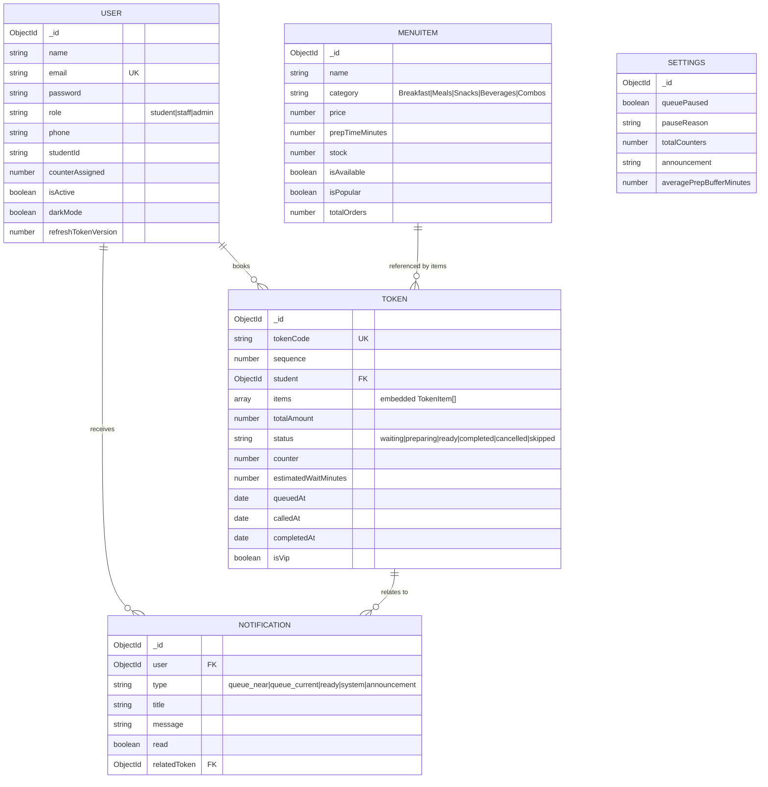
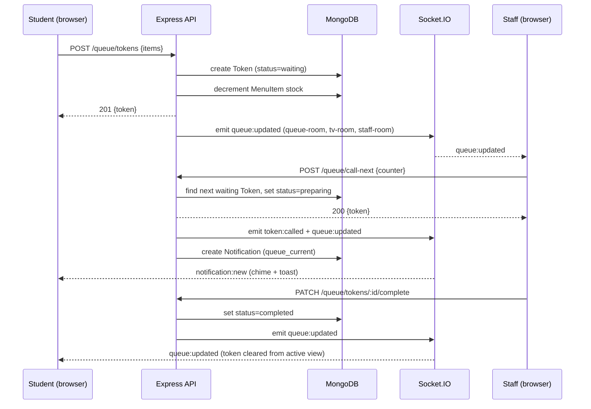
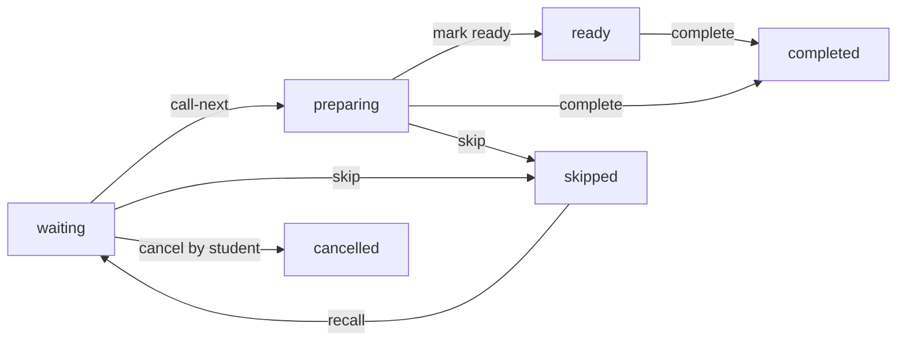

# Database Design

MongoDB, accessed via Mongoose. Five collections back the whole app.

## ER Diagram

`Settings` is a singleton document (`singletonKey: 'GLOBAL'`), lazily created
on first access.

## Sequence: booking and serving a token

## Queue flow (state machine)

## Indexing notes

- `Token`: compound index on `{ status: 1, sequence: 1 }` for fast live-queue queries, and `{ student: 1, createdAt: -1 }` for history lookups.
- `MenuItem`: text index on `name` for search, plus `{ category: 1 }`.
- `User`: unique index on `email`.
- `Notification`: `{ user: 1, createdAt: -1 }` for the notification feed.

## Token code generation

Codes are generated per-day (`A001`, `A002`, … `A999`, then `B001`, …) based
on how many tokens have been created since midnight — see
`generateTokenCode()` in `backend/src/services/queueService.ts`.
